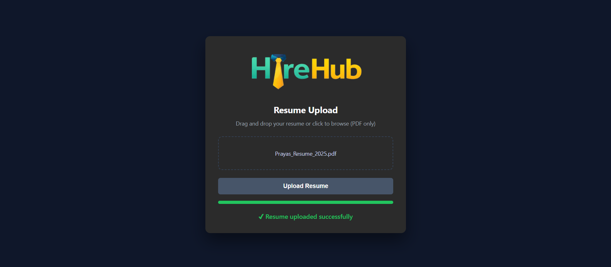
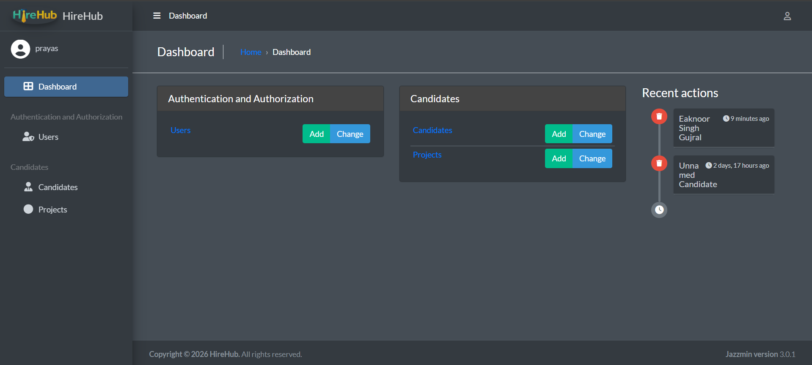
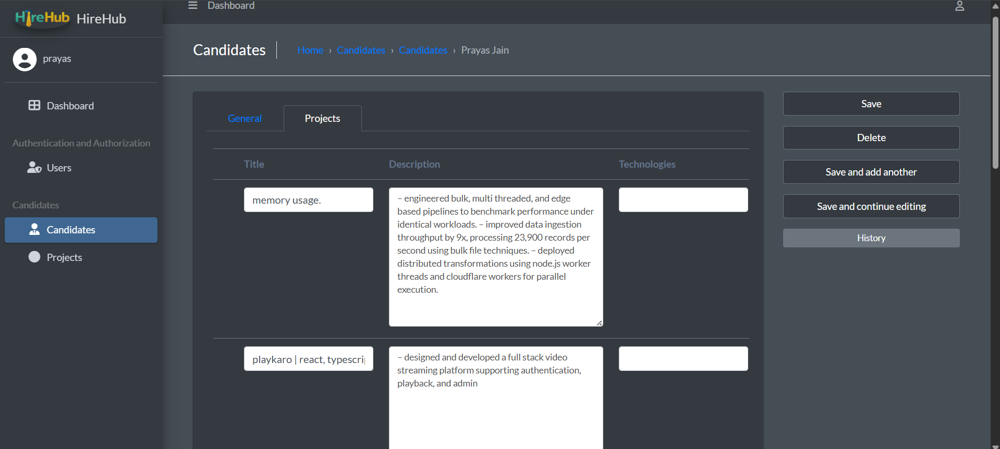

# Resume Parsing Dashboard

A lightweight Applicant Tracking System (ATS) that automatically parses resumes and provides a clean admin dashboard for candidate review.

This project demonstrates real-world backend development practices including file handling, PDF parsing, structured data extraction, and clean UI integration.

---

## ✨ Features

### Public Interface
- Clean and modern resume upload UI
- Drag and drop PDF upload
- Upload progress indicator
- Upload success animation
- Company branding with logo and favicon
- PDF-only upload validation

### Admin Dashboard Capabilities

- Secure admin authentication
- List and detail views for candidates
- Auto-parsed resume data displayed per candidate
- Skill-based search and filtering
- Resume file preview and download
- Clean, modern Django Admin UI

### Backend Capabilities
- Django ORM for database management
- Text-based PDF parsing using `pdfplumber`
- Deterministic skill extraction logic
- Scalable and maintainable project structure

---

## 🛠 Tech Stack

- **Backend:** Python, Django
- **Frontend:** HTML, CSS, JavaScript
- **Database:** SQLite (development)
- **PDF Parsing:** pdfplumber
- **Version Control:** Git & GitHub

---

## 📁 Project Structure

```

resume-parsing-dashboard/
│
├── config/              # Django project configuration
├── core/                # Public upload views
├── candidates/          # Candidate models and parsing logic
├── templates/           # HTML templates
├── static/              # CSS, images, favicon
├── media/               # Uploaded resumes (git-ignored)
├── manage.py
├── requirements.txt
└── README.md

````

---

##  Getting Started

### 1. Clone the repository
```bash
git clone https://github.com/your-username/resume-parsing-dashboard.git
cd resume-parsing-dashboard
````

### 2. Create and activate virtual environment

```bash
python -m venv .venv
.venv\Scripts\activate
```

### 3. Install dependencies

```bash
pip install -r requirements.txt
```

### 4. Apply database migrations

```bash
python manage.py migrate
```

### 5. Create admin user

```bash
python manage.py createsuperuser
```

### 6. Run the development server

```bash
python manage.py runserver
```

---

## 🌐 Usage

* **Public Upload Page:**
  [http://127.0.0.1:8000/](http://127.0.0.1:8000/)

* **Admin Dashboard:**
  [http://127.0.0.1:8000/admin/](http://127.0.0.1:8000/admin/)

### Application Flow

1. Candidate uploads a resume PDF
2. Resume is stored securely on the server
3. Backend extracts candidate details and skills
4. Admin reviews and manages candidates via dashboard

---

## 🔒 Security & Best Practices

* Admin-only access to candidate data
* Uploaded resumes excluded from version control
* Environment-specific files ignored using `.gitignore`
* No sensitive information committed to the repository

---

## 📸 Screenshots






---

## 🧩 Future Enhancements

* Skill-based candidate ranking
* Years of experience detection
* CSV / Excel export from admin
* AI-powered resume summarization
* Production deployment with PostgreSQL and cloud storage
* Role-based admin permissions

---

## 📜 License

This project is intended for educational, portfolio, and internal tooling purposes.
You are free to modify and extend it for your own use.

---
